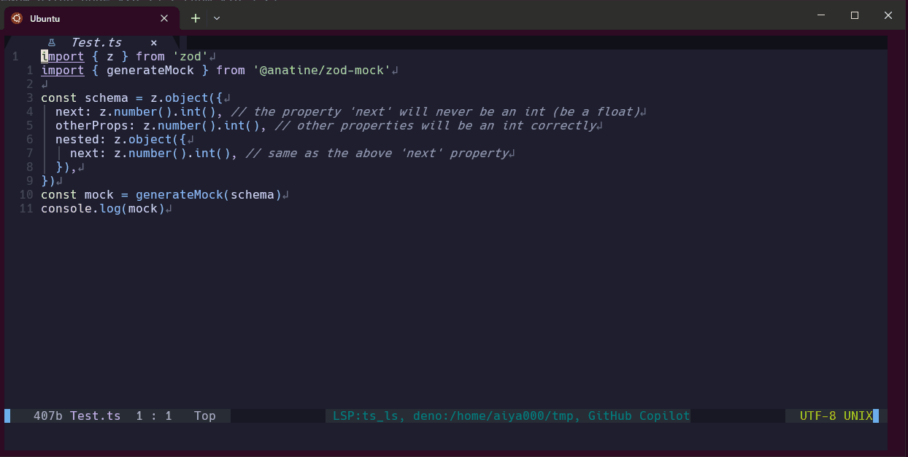
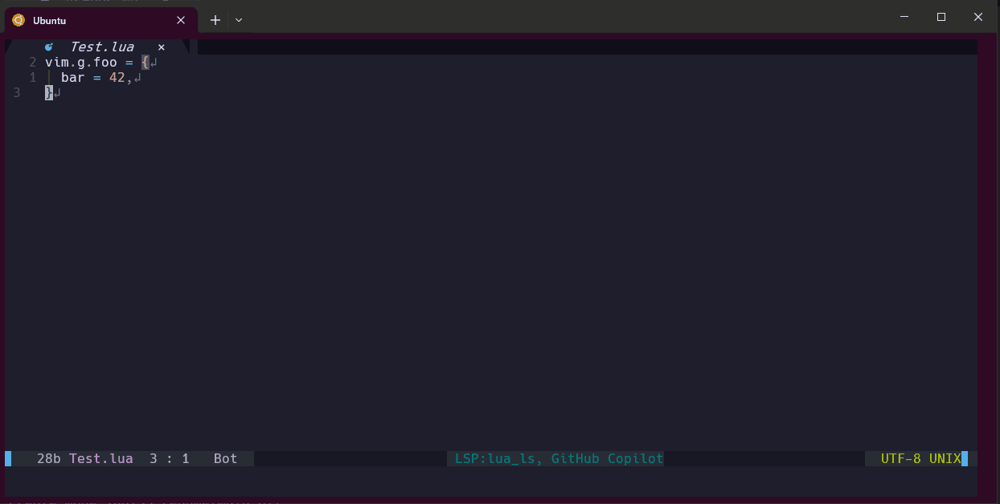
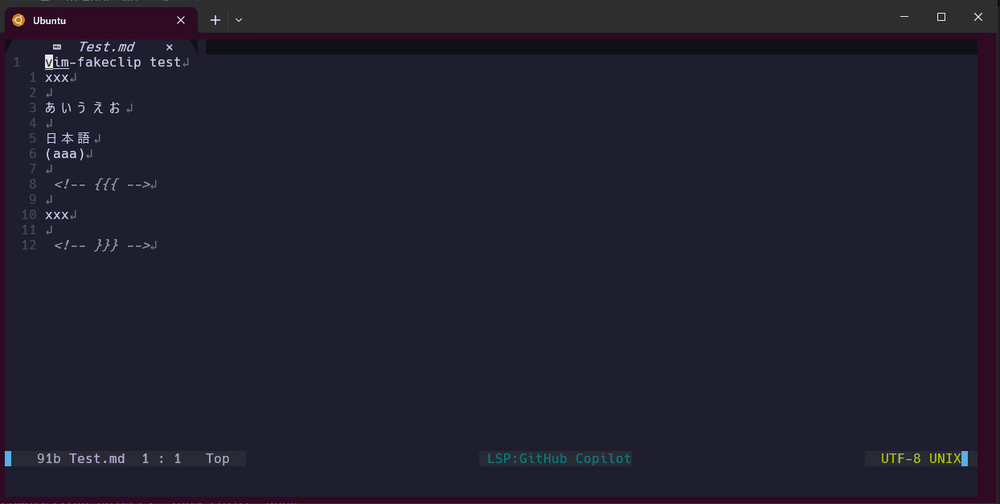
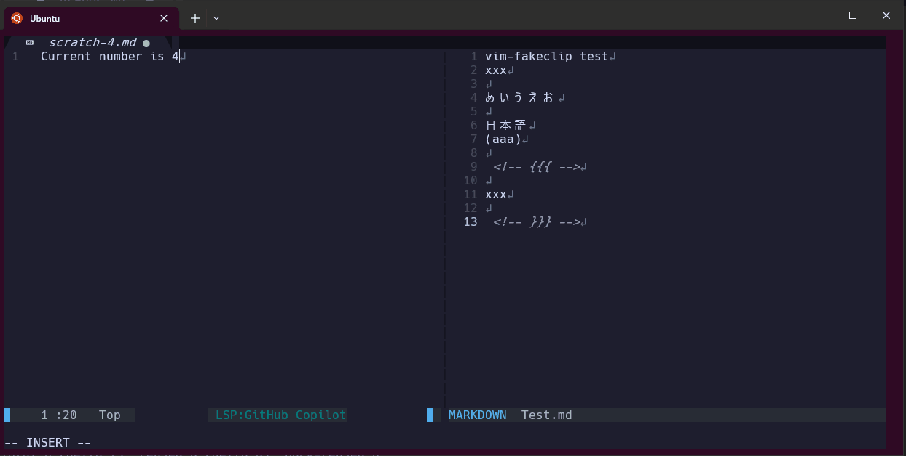

# :sparkles: nvim-mado-scratch :sparkles:

:rocket: **No more hassle with file paths!** The fastest way to open an instant scratch buffer.

For :star:Neovim:star: (lua-based modern implementation).



## Table of Contents

- [:sparkles: nvim-mado-scratch :sparkles:](#sparkles-mado-scratchnvim-sparkles)
  - [:gear: Installation](#gear-installation)
  - [:wrench: Configuration](#wrench-configuration)
  - [:wrench: Quick Start](#wrench-quick-start)
  - [:fire: Why nvim-mado-scratch?](#fire-why-mado-scratchnvim)
  - [:zap: Supercharge with vim-quickrun!](#zap-supercharge-with-vim-quickrun)
  - [:balance_scale: Comparison with scratch.vim](#balance_scale-comparison-with-scratchvim)
    - [:gear: Detailed Usage](#gear-detailed-usage)
  - [:keyboard: Default Keymappings](#keyboard-default-keymappings)
  - [:sparkles: scratch.vim Compatibility](#sparkles-scratchvim-compatibility)

- - - - -

## :star: Features

- Open temporary buffer by **only a keymap** or a command
- Auto close when you leave the opened buffer
- Auto save when you leave from insert mode in the opened buffer (for file buffers)


- - -

- Open temporary buffer with specified filetype



- - -

- Open multiple buffers with sequential numbering
    - Meaning you can:
        - Write multiple memos with different topics
        - Create a new buffer when needed without deleting the previous one
        - Collect your knowledges



Allright, you can clean them up when you want.



- - -

And more features...

## :gear: Installation

### Using [lazy.nvim](https://github.com/folke/lazy.nvim)

```lua
{
  'aiya000/nvim-mado-scratch',
  config = function()
    require('mado-scratch').setup({
      -- Optional configuration (these are defaults)
      file_pattern = {
        when_tmp_buffer = '/tmp/mado-scratch-tmp-%d',
        when_file_buffer = '/tmp/mado-scratch-file-%d',
      },
      default_file_ext = 'md',
      default_open_method = { method = 'sp', height = 15 },
      auto_save_file_buffer = true,
      use_default_keymappings = false,  -- Set to true to enable default keymaps
      auto_hide_buffer = {
        when_tmp_buffer = false,
        when_file_buffer = false,
      },
    })
  end,
}
```

You can also use other open methods:
- `{ method = 'float-fixed', size = { width = 80, height = 24 } }` - floating window with fixed size (requires plenary.nvim)
- `{ method = 'float-aspect', scale = { width = 0.8, height = 0.8 } }` - floating window with aspect ratio (requires plenary.nvim)
- `{ method = 'sp', height = 15 }` - horizontal split (no plenary.nvim required)
- `{ method = 'vsp', width = 30 }` - vertical split (no plenary.nvim required)
- `{ method = 'tabnew' }` - new tab (no plenary.nvim required)

Please also see [Configuration](#wrench-configuration) section and `:help mado-scratch.nvim` for more details.

### Using [packer.nvim](https://github.com/wbthomason/packer.nvim)

```lua
use {
  'aiya000/nvim-mado-scratch',
  config = function()
    require('mado-scratch').setup()
  end
}
```

### Optional Dependency

- [plenary.nvim](https://github.com/nvim-lua/plenary.nvim) for floating window support ↓

To use floating windows, configure `default_open_method` like this:

```lua
{
  'aiya000/nvim-mado-scratch',
  config = function()
    require('mado-scratch').setup({
      default_open_method = { method = 'float-aspect', scale = { width = 0.8, height = 0.8 } } -- Scale
      -- default_open_method = { method = 'float-fixed', size = { width = 80, height = 24 } }, -- Fixed size
    })
  end,
}
```

## :wrench: Configuration

The plugin works out of the box with sensible defaults, but you can customize it:

```lua
require('mado-scratch').setup({
  -- File patterns for temporary and persistent buffers
  file_pattern = {
    when_tmp_buffer = '/tmp/mado-scratch-tmp-%d',      -- For :MadoScratchOpen
    when_file_buffer = vim.fn.expand('~/scratch/%d'), -- For :MadoScratchOpenFile
  },

  -- Default settings
  default_file_ext = 'md',           -- Default file extension
  default_open_method = { method = 'sp', height = 15 }, -- Default open method (See ':help mado-scratch-configuration')

  -- Behavior options
  auto_save_file_buffer = true,      -- Auto-save file buffers on InsertLeave and before buffer destruction
                                      -- WARNING: If set to false with float windows, unsaved content may be lost on window close
                                      -- (Fix in progress: https://github.com/aiya000/nvim-mado-scratch/issues/19)
  use_default_keymappings = true,    -- Enable default keymaps

  -- Auto-hide settings (like scratch.vim)
  auto_hide_buffer = {
    when_tmp_buffer = false,         -- Auto-hide temporary buffers
    when_file_buffer = false,        -- Auto-hide persistent buffers
  },
})
```

## :wrench: Quick Start

```vim
:MadoScratchOpen  " Open a temporary buffer using default options
:MadoScratchOpen md sp 5  " Open a temporary Markdown buffer with :sp and height 5
:MadoScratchOpenFile ts vsp 100  " Open a persistent TypeScript buffer with :vsp and width 100
:MadoScratchOpen py float-fixed 80x40  " Open a Python buffer in a floating window with size 80x40
:MadoScratchOpen hs float-aspect 0.9x0.8  " Open a Haskell buffer in a floating window with 90% width and 80% height of the screen
```

```vim
:MadoScratchOpenNext  " Open next temporary buffer
:MadoScratchOpenFileNext  " Open next persistent buffer
```

Please see '[Detailed Usage](#gear-detailed-usage)' section for more information.

## :fire: Why nvim-mado-scratch?

- **Open instantly!** Just run `:MadoScratchOpen`!
- **No file management!** Perfect for quick notes and testing code snippets.
- **Works anywhere!** Whether in terminal Vim or GUI, it's always at your fingertips.

## :zap: Supercharge with vim-quickrun!

:bulb: **Combine it with [vim-quickrun](https://github.com/thinca/vim-quickrun) to execute code instantly!**

```vim
" Write TypeScript code...
:MadoScratchOpen ts

" ...and run it immediately!
:QuickRun
```

## :balance_scale: Comparison with scratch.vim

[scratch.vim](https://github.com/mtth/scratch.vim) is a great plugin.
However, nvim-mado-scratch adds more features.

Compared to scratch.vim, nvim-mado-scratch provides these additional features:

- Flexible buffer management
    - Open multiple buffers with sequential numbering (`:MadoScratchOpenNext`)
    - Quick access to recently used buffers (`:MadoScratchOpen`)
    - When you want to take notes on different topics, scratch.vim only allows one buffer
    - See `:help :MadoScratchOpen` and `:help :MadoScratchOpenNext`

- Buffer type options
    - Choose between writeable buffers or temporary buffers
    - Automatic saving for file buffers when enabled
    - Convert temporary buffers to persistent ones when needed
    - See `:help :MadoScratchOpen` and `:help :MadoScratchOpenFile`

- Customization options
    - Specify filetype for syntax highlighting, for `:QuickRun`, and for etc
    - Choose opening method (`:split`, `:vsplit`, `:tabnew`, or floating window)
    - Control buffer height/width
    - Configurable auto-hiding behavior: [scratch.vim compatibility](#sparkles-scratchvim-compatibility)
    - Customize buffer file locations:
      ```lua
      -- Configure different paths for temporary and persistent buffers
      require('mado-scratch').setup({
        file_pattern = {
          when_tmp_buffer = '/tmp/mado-scratch-tmp-%d',      -- For :MadoScratchOpen
          when_file_buffer = vim.fn.expand('~/scratch/%d'), -- For :MadoScratchOpenFile
        }
      })
      -- This is useful if you want to keep a file buffer directory
      -- (`~/scratch` in the above case) with `.prettier`, etc.
      ```

Please also see [doc/mado-scratch.txt](./doc/mado-scratch.txt) for other functions.

### :gear: Detailed Usage

```vim
" Basic Usage

" Open a temporary buffer using default settings
:MadoScratchOpen

" Same as :MadoScratchOpen but opens a writable persistent buffer
:MadoScratchOpenFile
```

```vim
" Open a new scratch buffer with a specific filetype

" Example: Markdown
:MadoScratchOpen md

" Example: TypeScript
:MadoScratchOpen ts

" Example: No filetype
:MadoScratchOpen --no-file-ext
```

```vim
" Open multiple scratch buffers
:MadoScratchOpen md      " Opens most recently used buffer
:MadoScratchOpenNext md  " Always creates a new buffer
```

```vim
" Open a small buffer at the top for quick notes
:MadoScratchOpen md sp 5
:MadoScratchOpen --no-file-ext sp 5

" Open a floating window for focused work
:MadoScratchOpen md float 80
:MadoScratchOpen js float 60
```

```vim
" Delete all scratch files and buffers
:MadoScratchClean
```

Please also see [doc/mado-scratch.txt](./doc/mado-scratch.txt) for other usage.

## :keyboard: Default Keymappings

When `use_default_keymappings` is enabled in setup (default: `false`), the following keymappings are available:

```lua
-- Enable default keymappings
require('mado-scratch').setup({
  use_default_keymappings = true,
})
```

The keymappings:
```vim
" Quick open commands (execute immediately)
<leader>b       → :MadoScratchOpen
<leader>B       → :MadoScratchOpenFile

" Interactive commands (allows adding arguments)
<leader><leader>b  → :MadoScratchOpen (with cursor ready for arguments)
<leader><leader>B  → :MadoScratchOpenFile (with cursor ready for arguments)
```

The quick open commands create buffers with default settings, while the interactive commands let you specify file extension, open method, and buffer size.

You can also define your own custom mappings:

```lua
-- Example custom mappings
vim.keymap.set('n', '<leader>s', '<Cmd>MadoScratchOpen<CR>', { silent = true })
vim.keymap.set('n', '<leader>S', '<Cmd>MadoScratchOpenFile<CR>', { silent = true })
```

## :sparkles: scratch.vim compatibility

To make the plugin behave like scratch.vim, you can enable automatic buffer hiding!
When enabled, scratch buffers will automatically hide when you leave the window.
You can configure this behavior separately for temporary buffers and file buffers.

Enable both types of buffer hiding with:

```lua
require('mado-scratch').setup({
  auto_hide_buffer = {
    when_tmp_buffer = true,
    when_file_buffer = true,
  },
})
```

Or enable hiding for only temporary buffers:

```lua
require('mado-scratch').setup({
  auto_hide_buffer = {
    when_tmp_buffer = true,
  },
})
```

Or enable hiding for only file buffers:

```lua
require('mado-scratch').setup({
  auto_hide_buffer = {
    when_file_buffer = true,
  },
})
```

- - - - -

💙 **Enjoying nvim-mado-scratch?**  
Show your support with a ⭐ on GitHub!

**Happy coding with Vim/Neovim!** ⚡✨
